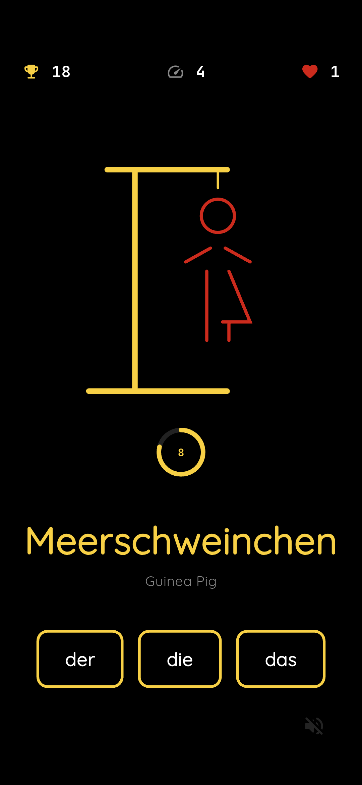

# Hangmensch

  

## About the Project
Hangmensch is a gamified learning tool. Players guess the correct article of a German noun. Incorrect guesses progressively build the Hangmensch.

## Tech Stack
- **Framework**: Flutter (Dart)
- **State Management**: Riverpod
- **Audio**: Audioplayers
- **Deployment**: GitHub Pages (Web) & GitHub Releases (Android APK)

## How to Play (Web)
1. Open the [Web App](https://3llips3s.github.io/hangmensch/).
2. Choose the correct article (der/die/das) of the German noun before the clock runs out to avoid the Hangmensch!

## Installation (Android)
1. Download the latest `app-release.apk` from the [Releases](https://github.com/3llips3s/hangmensch/releases) page.
2. Open the APK on your Android device.
3. If prompted, allow "Installation from Unknown Sources".
4. Install and enjoy :)

## License
Distributed under the MIT License. See `LICENSE` for more information.